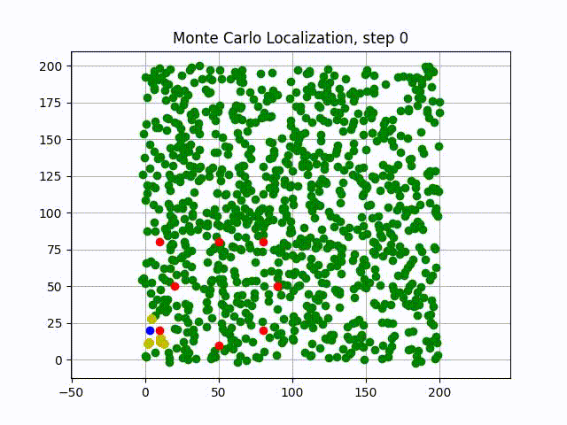
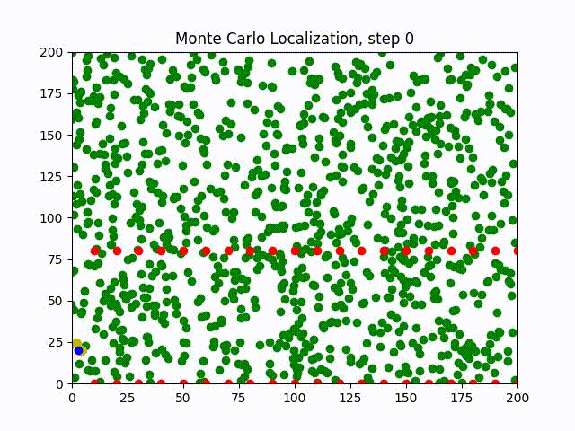
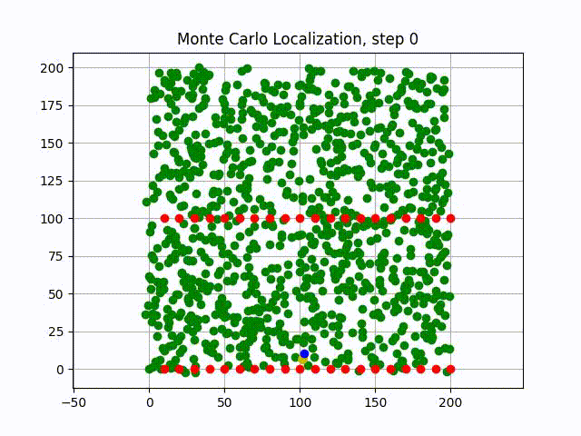

# Monte Carlo Localization (a.k.a Particle Filter Localization)

A simple repository to understand deeply the implementation of the Monte Carlo Localization (MCL) in modern C++, and further the adaptive Monte Carlo Localization (AMCL). I use this to debug the MCL implementation of some Robotic projects.





## Getting Started

Compiling the code:

```
mkdir build && cd build
cmake ..
make
```

Running the binary:

```
./mcl
```

## Generating a GIF from the images

```
ffmpeg -i images/steps%d.jpg -vf "fps=10,scale=640:-1:flags=lanczos" -t 5 output3.gif
```
or
```
ffmpeg -framerate 10 -i images/steps%d.jpg -t 10 -vf scale=640x480 output_jpg_2.gif
```
